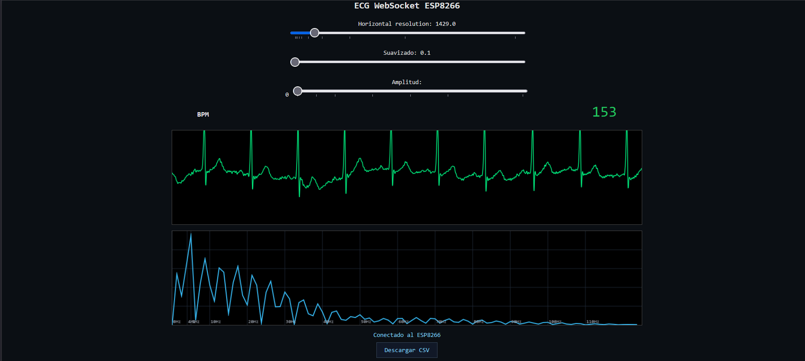
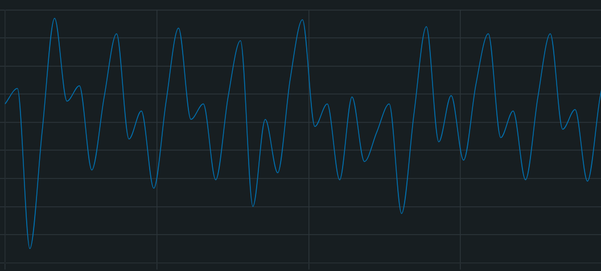
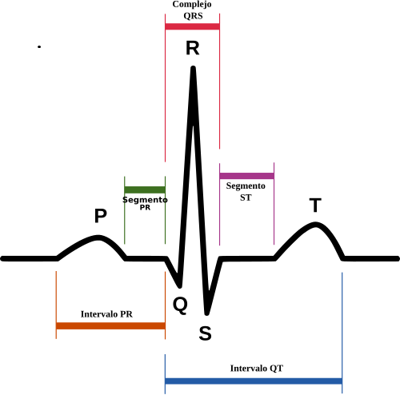
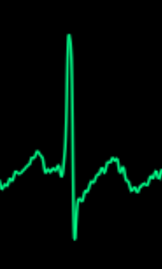

# NodeMCU 1.0 + AD8232

	
	### The wiring betwen NodeMCU and AD8232: ###
	### NodeMCU <-------> AD8232	###
	###   3.3V out        3.3V in	###
	###   Grnd            Grnd		###
	###    D5              LO+		###
	###    D6              LO-		###
	###  Analog input    Output		###

I've seen a lot of example code for the NodeMCU board that reads the analog output of the AD8232 circuit.

Even so, I couldn't get a clean ECG.

One of the problems was that the green and yellow wire are swapped.

## The correct wiring is:
	
	### RED: 	Rigth Arm; ###
	### GREEN: 	Left Arm;  ###
	### YELLOW: Rigth Leg; ###

#### So here's the code I've developed implementing all the lessons learned in the way.

#### In summary, NodeMCU creates an AP and a web server that displays an interface that receives data 
#### from the NodeMCU via websocket; the main page's JavaScript code receives, processes, and displays 
#### the data, both in the time domain and a fast FFT showing the frequency domain.

A button for downloading data to a csv file added.

Ideal wave shape vs output data

 
